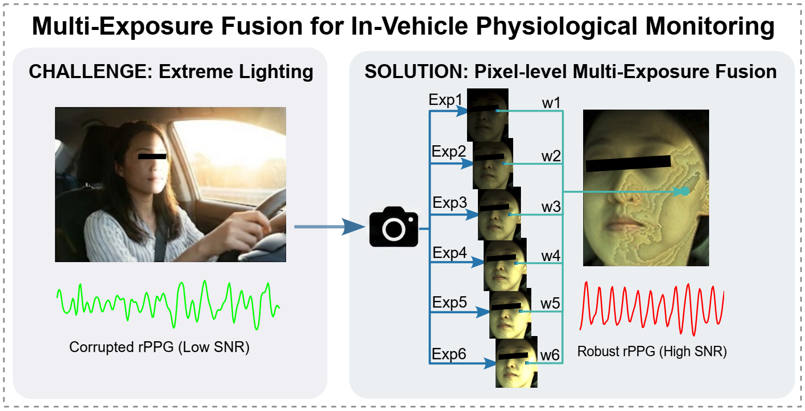
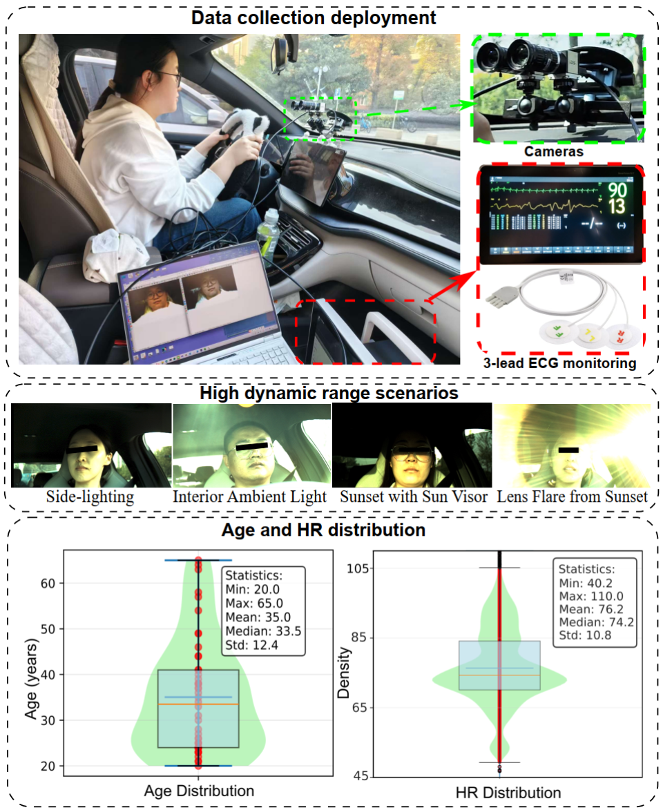
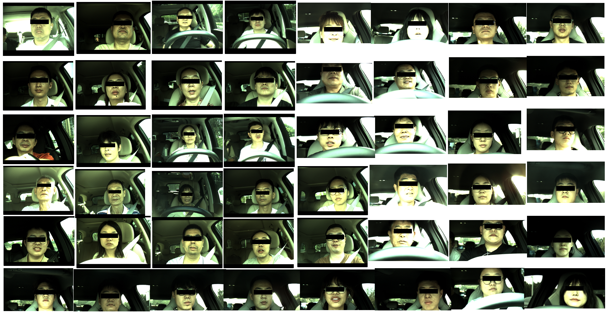
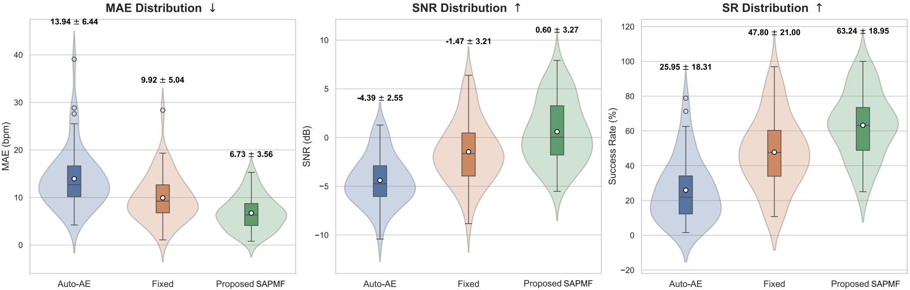

# SAPMF: Spatially-Adaptive Pixel-Level Multi-Exposure Fusion for In-Vehicle rPPG

This repository contains the introduction and dataset description for the paper: **"SAPMF: Spatially-Adaptive Pixel-Level Multi-Exposure Fusion for In-Vehicle Non-contact Heart-rate Monitoring"**.

## 🌟 Overview

Remote photoplethysmography (rPPG) is a promising non-contact solution for in-vehicle heart rate monitoring, but its performance is often hindered by extreme and non-uniform lighting transitions in driving environments. We propose **SAPMF**, a novel paradigm that shifts from global average-based optimization to fine-grained, pixel-wise selection to ensure high-fidelity signal capture.
 
Fig. 1: Conceptual overview of the proposed SAPMF framework. While conventional global exposure control fails to handle extreme in-vehicle lighting gradients (left), SAPMF independently optimizes every pixel coordinate through a multi-exposure stack, preserving physiological fidelity even under localized saturation (right).
---

## 🛠️ Methodology: The SAPMF Framework

The core philosophy of SAPMF is **"one-pixel-one-strategy"**. Unlike traditional global exposure control that falls into an "Average Trap" (where balancing the overall scene saturates localized facial regions), SAPMF independently optimizes every pixel coordinate.

### Key Technical Features:

* 
**Cyclic Multi-Exposure Acquisition:** The system captures a sequence of frames (e.g., $N=6$) with monotonically increasing exposure times to create an "exposure stack".
* 
**Pixel-Level Photometric Evaluation:** For each pixel $(i, j)$, the system calculates the deviation from a target luminance $I_{target}$ (typically 160 for 8-bit depth).
$$D_{k}(i,j)=|I_{k}(i,j)-I_{target}|$$
* 
**Adaptive Weighted Fusion:** The final optimized frame is synthesized by weighting candidates from the stack to maximize physiological information rather than visual aesthetics.

> **Note:** The fused frames may exhibit visual "patchwork" or "banding" artifacts due to spatial discontinuities in optimal exposure. However, since rPPG algorithms process the relative change rate of color, these DC-component jumps are mathematically cancelled out, preserving the underlying pulse wave.
---

## 📊 MEX-Drive Dataset

The **MEX-Drive (Multi-Exposure Drive)** dataset provides a rich, high-dynamic-range resource for non-contact physiological monitoring in vehicles.
* 
**Participants:** 48 licensed drivers.
* 
**Diversity:** Covers diverse weather (sunny, rainy, sunset glare), road types (highways, urban), and natural driver activities.
* **Data Channels:**
* 
**Video:** Synchronized facial videos captured across six distinct exposure levels per processing cycle.
* 
**Ground Truth:** Clinical-grade ECG reference (500 Hz) obtained via a Mindray BeneVision N17 patient monitor.
* 
**Demographics:** Subjects aged 20–65 (Mean: 35.0) with a heart rate distribution of $76.2 \pm 10.8$ bpm.
 
Fig. 2: Experimental setup and characteristics of the MEX-Drive dataset. (a) Hardware deployment of the dual-camera system and reference ECG for in-vehicle data acquisition; (b) Representative high dynamic range driving scenarios; (c) Demographic and physiological distribution (age and HR) across the 48 participants.

 
Fig. 3: Snapshots of the self-collected MEX-Drive dataset.
---

## 📈 Experimental Results

In real-road experiments, SAPMF significantly outperforms manufacturer-default auto-exposure and fixed exposure methods.
  
Fig. 4: Performance distribution of rPPG metrics across different exposure strategies (N = 48). The violin plots illustrate the probability density of MAE, SNR, and SR, with internal box plots indicating the median (red line), mean (white dot), and interquartile range.

---

## ✒️ Citation

If you use this dataset or method in your research, please cite:

```bibtex
@article{wang2026sapmf,
  title={SAPMF: Spatially-Adaptive Pixel-Level Multi-Exposure Fusion for In-Vehicle Non-contact Heart-rate Monitoring},
  author={Wang, Jieying and Cai, Xinqi and Shan, Caifeng and Wang, Wenjin},
  journal={unpublished},
  year={2026}
}

```
